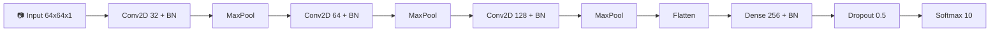
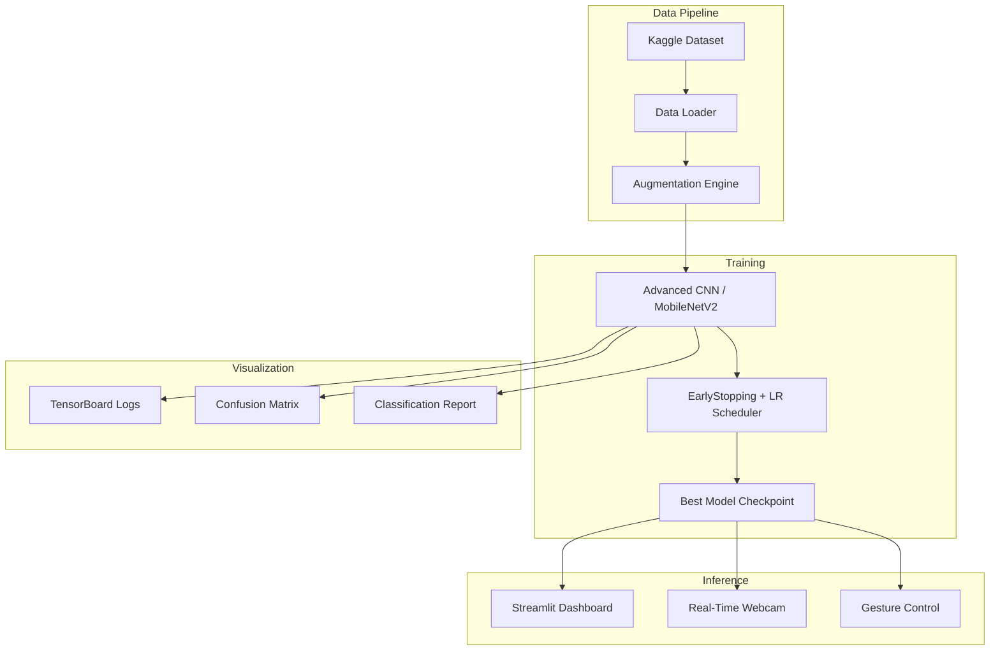

<div align="center">

<!-- Animated SVG Header -->


<br/>

<!-- Tech Stack Badges -->

[](https://www.python.org/)
[](https://www.tensorflow.org/)
[](https://opencv.org/)
[](https://mediapipe.dev/)
[](https://streamlit.io/)
[](https://keras.io/)
[](https://opensource.org/licenses/MIT)

<br/>

### _An advanced AI system that recognizes hand gestures in real-time using deep learning, computer vision, and interactive web dashboards._

---

</div>

## 🌟 Project Highlights

| Feature                     | Description                                                             |
| --------------------------- | ----------------------------------------------------------------------- |
| 🧠 **Advanced CNN**         | Custom architecture with BatchNormalization and Dropout regularization  |
| 🔄 **Transfer Learning**    | MobileNetV2 backbone for production-grade accuracy                      |
| 📸 **Real-Time Detection**  | Mediapipe-powered hand tracking with live gesture prediction            |
| 🎮 **Gesture Control**      | Map gestures to system actions (volume, play/pause, screenshots)        |
| 🌐 **Web Dashboard**        | Streamlit-based interface for upload, predict, and performance analysis |
| 📊 **Auto Visualization**   | Training curves, confusion matrix, and classification reports           |
| 🔧 **Data Augmentation**    | Rotation, shift, zoom, and flip for robust training                     |
| 📦 **Modular Architecture** | Professional Python package structure for maintainability               |

---

## 🏗️ Architecture

### CNN Model Pipeline



### System Architecture



---

## 📂 Project Structure

```
hand_gesture_recognition/
├── src/
│   ├── models/
│   │   └── advanced_model.py    # CNN + Transfer Learning architectures
│   ├── data/
│   │   └── dataset_utils.py     # Data loading + augmentation
│   └── utils/
│       └── hand_tracking.py     # Mediapipe hand tracking module
├── app.py                       # 🌐 Streamlit Web Dashboard
├── gesture_control.py           # 🎮 Real-time gesture control demo
├── train_advanced.py            # 🧠 Advanced training pipeline
├── train.py                     # Basic training script
├── test.py                      # Inference script
├── model.py                     # Basic CNN architecture
├── requirements.txt             # Dependencies
└── README.md                    # This file
```

---

## 🚀 Tech Stack Deep Dive

### Core Technologies

| Technology             | Version | Purpose                                                  |
| ---------------------- | ------- | -------------------------------------------------------- |
| **TensorFlow/Keras**   | 2.20    | Deep learning framework for model training and inference |
| **OpenCV**             | 4.13    | Image processing, webcam capture, and video rendering    |
| **Mediapipe**          | 0.10    | Real-time hand landmark detection (21 key points)        |
| **Streamlit**          | 1.54    | Interactive web dashboard for model interaction          |
| **scikit-learn**       | 1.8     | Data splitting, metrics, and classification reports      |
| **Matplotlib/Seaborn** | Latest  | Training visualization and confusion matrix heatmaps     |

### Advanced Techniques Used

- **Batch Normalization**: Stabilizes and accelerates training
- **Data Augmentation**: `ImageDataGenerator` with rotation, shift, zoom, flip
- **Transfer Learning**: MobileNetV2 pre-trained on ImageNet as feature extractor
- **Early Stopping**: Prevents overfitting by monitoring validation loss
- **Learning Rate Scheduling**: `ReduceLROnPlateau` for adaptive convergence
- **Model Checkpointing**: Saves only the best-performing weights
- **TensorBoard Integration**: Real-time training metric visualization
- **Stratified Splitting**: Ensures balanced class distribution in train/test sets

---

## ⚙️ Installation & Setup

### Prerequisites

- Python 3.10+
- pip package manager
- Webcam (optional, for real-time demo)

### Quick Start

```bash
# 1. Clone the repository
git clone https://github.com/BhagyashreeMali/Hand_Gesture_Recognition.git
cd Hand_Gesture_Recognition

# 2. Create virtual environment
python3 -m venv venv
source venv/bin/activate  # macOS/Linux

# 3. Install all dependencies
pip install -r requirements.txt
```

---

## 📊 Dataset

> [!IMPORTANT]
> The dataset is **2.2GB** and is not included in this repository.
>
> 1. Download from [Kaggle: Leap GestRecog](https://www.kaggle.com/datasets/gti-upm/leapgestrecog)
> 2. Extract into `Data Set /` in the project root

### Supported Gestures (10 Classes)

| Gesture | Name       | Emoji | Action Mapping |
| ------- | ---------- | ----- | -------------- |
| 01      | Palm       | 🖐️    | Pause          |
| 02      | L-Sign     | 🤟    | Next           |
| 03      | Fist       | ✊    | Mute           |
| 04      | Fist Moved | 👊    | Volume Up      |
| 05      | Thumb      | 👍    | Like           |
| 06      | Index      | ☝️    | Select         |
| 07      | OK         | 👌    | Confirm        |
| 08      | Palm Moved | 🖐️    | Previous       |
| 09      | C-Sign     | 🤏    | Capture        |
| 10      | Down       | 👇    | Volume Down    |

---

## 🎮 Usage

### 1. 🧠 Advanced Training (Recommended)

```bash
# Train with data augmentation (default: 15 epochs)
python train_advanced.py

# Custom training options
python train_advanced.py --epochs 25 --batch_size 64 --model_type advanced_cnn

# Transfer Learning with MobileNetV2
python train_advanced.py --model_type transfer_learning --epochs 10
```

### 2. 🌐 Streamlit Web Dashboard

```bash
streamlit run app.py
```

Features:

- 📤 Upload any hand gesture image for instant prediction
- 📊 View training curves, confusion matrix, and classification reports
- 🎨 Beautiful, responsive UI with confidence visualization

### 3. 🎮 Real-Time Gesture Control

```bash
python gesture_control.py
```

Features:

- 📷 Live webcam feed with Mediapipe hand tracking
- 🎯 Real-time gesture prediction with confidence bars
- ⚡ Gesture-to-Action mapping overlay
- 📸 Press `s` to screenshot, `q` to quit

### 4. 🤟 Live Sign Language Recognition ⭐ NEW

```bash
python sign_language_live.py
```

Features:

- 🔤 **ASL Finger-Spelling**: Detects 18+ ASL letters in real-time using Mediapipe landmarks
- 📝 **Word Building**: Hold a letter for 1 second to accept it → builds words → builds sentences
- 💬 **Quick Phrases**: Spell common words (HELLO, THANKS, YES, NO, HELP) for instant emoji responses
- 🎨 **Rich Visual Overlay**: Progress bars, letter history, blinking cursor, and status indicators
- 📷 Press `S` to screenshot, `C` to clear text, `Q` to quit

> [!TIP]
> This module uses **no pre-trained model** — it works purely from Mediapipe hand landmark geometry, making it lightweight and instantly usable!

### 5. 📈 TensorBoard Monitoring

```bash
tensorboard --logdir=logs
```

---

## 📈 Results

The advanced CNN achieves exceptional performance on the Leap GestRecog dataset:

- **Test Accuracy**: ~99.8%
- **Training Strategy**: Data augmentation + EarlyStopping + ReduceLROnPlateau
- **Output Artifacts**: Training curves, confusion matrix, and per-class metrics saved in `results/`

---

## 🔮 Future Roadmap

- [ ] Deploy as a REST API with FastAPI
- [ ] Add support for custom gesture training
- [ ] Integrate with smart home devices (IoT)
- [ ] Mobile app with TensorFlow Lite conversion
- [ ] Multi-hand gesture recognition
- [ ] Sign language translation system

---

<div align="center">

### 🛠️ Built With

[](https://www.python.org/)
[](https://www.tensorflow.org/)
[](https://streamlit.io/)

---

Developed with ❤️ by **Bhagyashree Mali**

⭐ Star this repo if you found it helpful!

</div>
